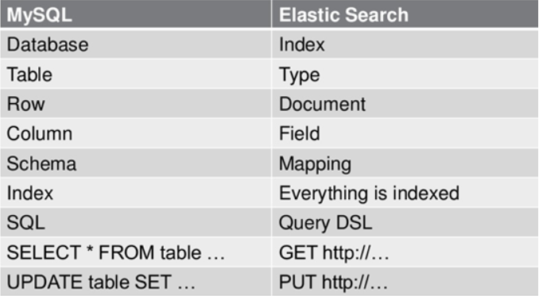
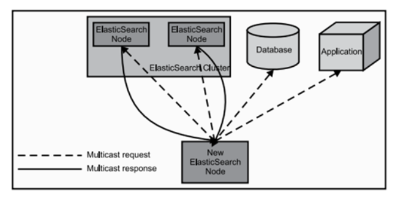
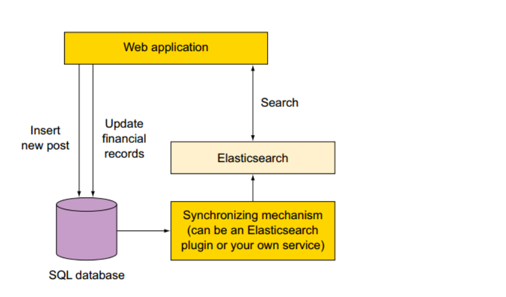
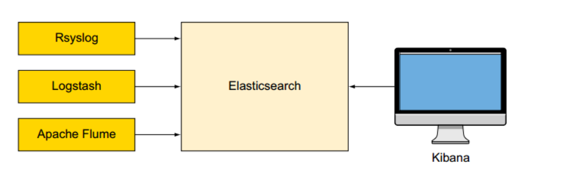

#### Elasticsearch数据检索分析

##### 一、ES定义

​	ES=elaticsearch简写， Elasticsearch是一个开源的高扩展的分布式全文检索引擎，它可以近乎实时的存储、检索数据；本身扩展性很好，可以扩展到上百台服务器，处理PB级别的数据。 
​	Elasticsearch也使用Java开发并使用Lucene作为其核心来实现所有索引和搜索的功能，但是它的目的是通过简单的RESTful API来隐藏Lucene的复杂性，从而让全文搜索变得简单。

##### 二、Lucene与ES关系

1、Lucene只是一个库。想要使用它，必须使用Java来作为开发语言并将其直接集成到你的应用中，更糟糕的是，Lucene非常复杂，你需要深入了解检索的相关知识来理解它是如何工作的。

2、Elasticsearch也使用Java开发并使用Lucene作为其核心来实现所有索引和搜索的功能，但是它的目的是通过简单的RESTful API来隐藏Lucene的复杂性，从而让全文搜索变得简单。

##### 三、ES主要解决问题

1、检索相关数据

2、返回统计结果

3、速度要快

##### 四、ES核心概念

1、Cluster: 集群

​	ES可以作为一个独立的单个搜索服务器。不过，为了处理大型数据集，实现容错和高可用性，ES可以运行在许多互相合作的服务器上。这些服务器的集合称为集群。

2、Node: 节点

​	形成集群的每个服务器称为节点。

3、Shard: 分片

​	当有大量的文档时，由于内存的限制、磁盘处理能力不足、无法足够快的响应客户端的请求等，一个节点可能不够。这种情况下，数据可以分为较小的分片。每个分片放到不同的服务器上。 

​	当你查询的索引分布在多个分片上时，ES会把查询发送给每个相关的分片，并将结果组合在一起，而应用程序并不知道分片的存在。即：这个过程对用户来说是透明的。

4、Replia: 副本

​	为提高查询吞吐量或实现高可用性，可以使用分片副本。 
副本是一个分片的精确复制，每个分片可以有零个或多个副本。ES中可以有许多相同的分片，其中之一被选择更改索引操作，这种特殊的分片称为主分片。 当主分片丢失时，如：该分片所在的数据不可用时，集群将副本提升为新的主分片。

5、全文索引

​	采用分词器，对文本每个词进行切分，建立词条，方便进行查找

##### 五、ES数据结构主要概念

与关系数据库Mysql对比：



1、关系型数据库中的数据库（DataBase），等价于ES中的索引（Index） 
2、一个数据库下面有N张表（Table），等价于1个索引Index下面有N多类型（Type）， 
3、一个数据库表（Table）下的数据由多行（ROW）多列（column，属性）组成，等价于1个Type由多个文档（Document）和多Field组成。 
4、在一个关系型数据库里面，schema定义了表、每个表的字段，还有表和字段之间的关系。 与之对应的，在ES中：Mapping定义索引下的Type的字段处理规则，即索引如何建立、索引类型、是否保存原始索引JSON文档、是否压缩原始JSON文档、是否需要分词处理、如何进行分词处理等。 
5、在数据库中的增insert、删delete、改update、查search操作等价于ES中的增PUT/POST、删DELETE、改UPDATE、查GET。

##### 六、ES工作原理

当ElasticSearch的节点启动后，它会利用多播(multicast)(或者单播，如果用户更改了配置)寻找集群中的其它节点，并与之建立连接。这个过程如下图所示：



1、Elasticsearch是如何实现Master选举的？

      Elasticsearch的选举是ZenDiscovery模块负责的，主要包含Ping（节点之间通过这个RPC来发现彼此）和Unicast（单播模块包含一个主机列表以控制哪些节点需要ping通）这两部分；
    
      对所有可以成为master的节点（node.master: true）根据nodeId字典排序，每次选举每个节点都把自己所知道节点排一次序，然后选出第一个（第0位）节点，暂且认为它是master节点。
    
      如果对某个节点的投票数达到一定的值（可以成为master节点数n/2+1）并且该节点自己也选举自己，那这个节点就是master。否则重新选举一直到满足上述条件。
    
      补充：master节点的职责主要包括集群、节点和索引的管理，不负责文档级别的管理；data节点可以关闭http功能。

2、Elasticsearch中的节点（比如共20个），其中的10个选了一个master，另外10个选了另一个master，怎么办？

      当集群master候选数量不小于3个时，可以通过设置最少投票通过数量  （discovery.zen.minimum_master_nodes）超过所有候选节点一半以上来解决脑裂问题；
    
      当候选数量为两个时，只能修改为唯一的一个master候选，其他作为data节点，避免脑裂问题。

3、详细描述一下Elasticsearch索引文档的过程。

      协调节点默认使用文档ID参与计算（也支持通过routing），以便为路由提供合适的分片。shard = hash(document_id) % (num_of_primary_shards)
    
      当分片所在的节点接收到来自协调节点的请求后，会将请求写入到Memory Buffer，然后定时（默认是每隔1秒）写入到Filesystem Cache，这个从Momery Buffer到Filesystem Cache的过程就叫做refresh；
    
      当然在某些情况下，存在Momery Buffer和Filesystem Cache的数据可能会丢失，ES是通过translog的机制来保证数据的可靠性的。其实现机制是接收到请求后，同时也会写入到translog中，当Filesystem cache中的数据写入到磁盘中时，才会清除掉，这个过程叫做flush；
    
      在flush过程中，内存中的缓冲将被清除，内容被写入一个新段，段的fsync将创建一个新的提交点，并将内容刷新到磁盘，旧的translog将被删除并开始一个新的translog。
    
      flush触发的时机是定时触发（默认30分钟）或者translog变得太大（默认为512M）时；

4、详细描述一下Elasticsearch更新和删除文档的过程。

      删除和更新也都是写操作，但是Elasticsearch中的文档是不可变的，因此不能被删除或者改动以展示其变更；
    
      磁盘上的每个段都有一个相应的.del文件。当删除请求发送后，文档并没有真的被删除，而是在.del文件中被标记为删除。该文档依然能匹配查询，但是会在结果中被过滤掉。当段合并时，在.del文件中被标记为删除的文档将不会被写入新段。
    
      在新的文档被创建时，Elasticsearch会为该文档指定一个版本号，当执行更新时，旧版本的文档在.del文件中被标记为删除，新版本的文档被索引到一个新段。旧版本的文档依然能匹配查询，但是会在结果中被过滤掉。

5、详细描述一下Elasticsearch搜索的过程。

      搜索被执行成一个两阶段过程，我们称之为 Query Then Fetch；
    
      在初始查询阶段时，查询会广播到索引中每一个分片拷贝（主分片或者副本分片）。 每个分片在本地执行搜索并构建一个匹配文档的大小为 from + size 的优先队列。PS：在搜索的时候是会查询Filesystem Cache的，但是有部分数据还在Memory Buffer，所以搜索是近实时的。
    
      每个分片返回各自优先队列中 所有文档的 ID 和排序值 给协调节点，它合并这些值到自己的优先队列中来产生一个全局排序后的结果列表。
    
      接下来就是 取回阶段，协调节点辨别出哪些文档需要被取回并向相关的分片提交多个 GET 请求。每个分片加载并 丰富 文档，如果有需要的话，接着返回文档给协调节点。一旦所有的文档都被取回了，协调节点返回结果给客户端。
      
      补充：Query Then Fetch的搜索类型在文档相关性打分的时候参考的是本分片的数据，这样在文档数量较少的时候可能不够准确，DFS Query Then Fetch增加了一个预查询的处理，询问Term和Document frequency，这个评分更准确，但是性能会变差。

6、Elasticsearch对于大数据量（上亿量级）的聚合如何实现？

      Elasticsearch 提供的首个近似聚合是cardinality 度量。它提供一个字段的基数，即该字段的distinct或者unique值的数目。它是基于HLL算法的。HLL 会先对我们的输入作哈希运算，然后根据哈希运算的结果中的 bits 做概率估算从而得到基数。其特点是：可配置的精度，用来控制内存的使用（更精确 ＝ 更多内存）；小的数据集精度是非常高的；我们可以通过配置参数，来设置去重需要的固定内存使用量。无论数千还是数十亿的唯一值，内存使用量只与你配置的精确度相关。

7、在并发情况下，Elasticsearch如果保证读写一致？

      可以通过版本号使用乐观并发控制，以确保新版本不会被旧版本覆盖，由应用层来处理具体的冲突；
    另外对于写操作，一致性级别支持quorum/one/all，默认为quorum，即只有当大多数分片可用时才允许写操作。但即使大多数可用，也可能存在因为网络等原因导致写入副本失败，这样该副本被认为故障，分片将会在一个不同的节点上重建。
      对于读操作，可以设置replication为sync(默认)，这使得操作在主分片和副本分片都完成后才会返回；如果设置replication为async时，也可以通过设置搜索请求参数_preference为primary来查询主分片，确保文档是最新版本。
8、ES如何防止因宕机造成数据丢失？

```
  为了防止elasticsearch宕机造成数据丢失保证可靠存储，es会将每次写入数据同时写到translog日志中。
translog还用于提供实时CRUD。 当尝试按ID检索，更新或删除文档时，它会首先检查translog中是否有任何最近的更改，然后再尝试从相关段中检索文档。 这意味着它始终可以实时访问最新的已知文档版本
```

##### 七、使用场景

###### 1、使用ES作为主要的后端

​	Elasticsearch是提供持久存储、统计等多项功能的现代搜索引擎。 
新项目使用ES作为唯一的数据存储，可以保持设计尽可能简单。 此种场景不支持包含频繁更新、事务（transaction）的操作，所以一般不推荐使用

###### *2、在现有系统中增加ES

​	如果已经有一个在运行的复杂的系统，需求是在现有系统中添加检索服务。一种非常冒险的方式是重构系统以支持ES。而相对安全的方式是：将ES作为新的组件添加到现有系统中。 
如果使用了如下图所示的SQL数据库和ES存储，你需要找到一种方式使得两存储之间实时同步。需要根据数据的组成、数据库选择对应的同步插件。可供选择的插件包括： 
1）mysql、oracle选择 logstash-input-jdbc 插件。 
2）mongo选择 mongo-connector工具。



###### 3、使用ES和现有的工具

​	在一些情况下，不用写一行代码就能通过ES完成一项工作。很多工具都可以与ES一起工作。例如，部署大规模的日志框架存储，搜索，并分析大量数据。如流行的日志搜集分析框架ELK就是几种组件协同工作。日志记录工具除了Logstash还有Rsyslog，或Apache Flume，搜索和可视化可以使用Kibana，如下图：



##### 八、实践

